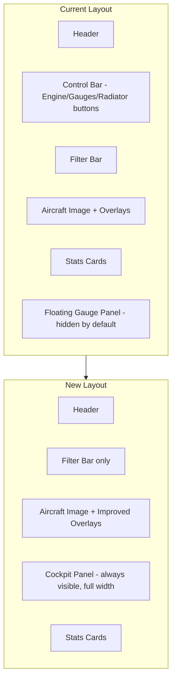

# Spitfire Interactive Page Improvements

## 1. Fix "Pilot's Notes" Content

**Problem:** The `funFact` fields are presented as pilot quotes but contain made-up information.

**Solution:** Rename to "Did You Know?" and replace with verified historical facts (not quotes). Keep the amber callout styling.

**Location:** Lines 38, 58, 77, 96, 116, 136, 156, 175, 194 in [`components/SpitfireInteractive.tsx`](components/SpitfireInteractive.tsx)

- Change `funFact` property to `didYouKnow` in the interface and data
- Update the modal display (line 697-702) to say "Did You Know?" instead of "Pilot's Note"
- Remove quote styling (italic, quotation marks)
- Rewrite content as factual statements, not quotes

---

## 2. Propeller Positioning

**Problem:** The propeller overlay is misaligned with the aircraft nose.

**Current positioning code (lines 470-478):**

```typescript
style={{ 
  left: '0.5%', 
  top: '38%',
  width: '6%',
  height: '24%',
}}
```

**Solution:** Extract these values into clearly named constants at the top of the component so you can easily fine-tune them:

```typescript
// Propeller overlay positioning - adjust these values to align with aircraft
const PROPELLER_POSITION = {
  left: '0.5%',    // horizontal position from left edge
  top: '38%',      // vertical position from top
  width: '6%',     // width of propeller area
  height: '24%',   // height of propeller area
};
```

Based on your screenshot, the propeller appears too far left. Likely needs `left: '2-4%'` and possibly `top: '40-42%'` adjustment.

---

## 3. Redesign Instrument Panel as Pseudo-Cockpit

**Problem:** Current panel is a hidden floating overlay, not a proper cockpit experience.

**Solution:** Create a dedicated `CockpitPanel` section that:

- Is **always visible by default** (change `showGauges` initial state to `true`, or remove toggle entirely)
- Lives as a **full-width block below the aircraft** (not an absolute overlay)
- On mobile: stacks vertically, full width
- Contains the **Engine Start** and **Radiator** controls integrated with gauges
- Matches Spitfire IX layout more closely

**New Layout (based on actual Spitfire IX panel):**

```
+------------------------------------------+
|              COCKPIT CONTROLS            |
+------------------------------------------+
|  [START ENGINE]              [RADIATOR]  |  <- Control toggles
+------------------------------------------+
|    ASI    |   ALT   |  RPM  |   BOOST   |  <- Top row instruments
+------------------------------------------+
|   TEMP    |   OIL   |  FUEL |  COMPASS  |  <- Bottom row instruments
+------------------------------------------+
```

Key instruments for Spitfire IX:

- **Airspeed Indicator (ASI)** - mph
- **Altimeter** - feet  
- **RPM** - engine revolutions
- **Boost Pressure** - manifold pressure (lbs/sq in)
- **Coolant Temperature** - degrees C (critical!)
- **Oil Pressure** - lbs/sq in
- **Oil Temperature** - degrees C
- **Fuel Gauge** - gallons remaining

**Implementation:**

- Move Engine Start button INTO the panel (styled as a red starter button)
- Move Radiator toggle INTO the panel (styled as a lever/switch)
- Remove the top control bar buttons for these
- Keep category filters in top bar

---

## 4. Visible Radiator Flap Animation

**Problem:** Current radiator visual is too subtle (just a border highlight and scaleY).

**Current code (lines 505-531):** A small `div` with `scaleY(1.5)` transform.

**Solution:** Create a more dramatic visual effect:

1. Add a radiator flap SVG/element that actually "opens" downward when toggled
2. Position it precisely under the wing where the radiator duct is (~38-42% from left, bottom area)
3. When closed: flat against the wing profile
4. When open: rotates/translates downward to show "airflow gap"
5. Add airflow particles/lines animating through when open

**Visual approach:**

```
Closed:  ====== (flat line under wing)
Open:    ======
           \
            \ (flap angled down, air flowing through)
```

The radiator scoop is visible in the image around 38-45% from left, under the wing. We'll overlay an animated flap element there.

---

## Summary of File Changes

| File | Changes |

|------|---------|

| [`components/SpitfireInteractive.tsx`](components/SpitfireInteractive.tsx) | All changes - refactor instrument panel, fix funFacts, add positioning constants, improve radiator animation |

